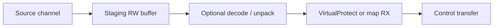
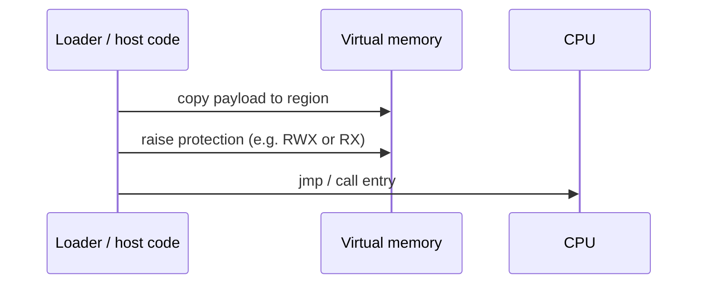
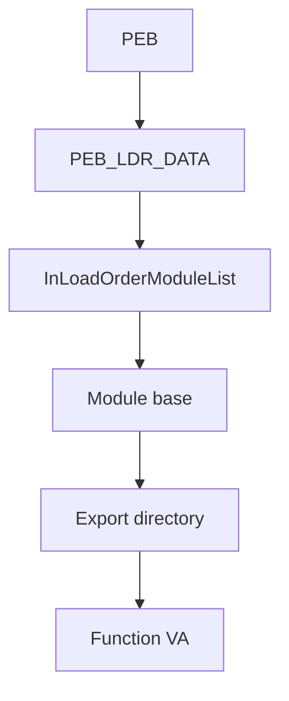

# Loader pattern glossary — informal names (reference)

Community and red-team literature reuse overlapping slang for a few **Windows process bootstrap** shapes. This note **names and sketches** them so Sovereign docs and threat reviews share vocabulary. It is **not** a promise to ship these as product features; for supported import policy see **`docs/SOVEREIGN_INTERNAL_RESOLVER_STRATEGY.md`**. For PE layout and IAT emission, see **`docs/SOVEREIGN_MASTER_TEMPLATE_v224.md`** and **`tools/pe_emitter.asm`**.

---

## 1. “Siphon–Slam” (informal block)

**Siphon:** pull bytes from a **source** (file tail, network chunk, registry blob, mapped view, IPC pipe, steganographic carrier, etc.) into a **staging buffer** in the address space.

**Slam:** treat that buffer as **code** by (a) placing it at a **known address**, (b) changing **memory protection** to allow execution, and (c) **transferring control** (direct call, tail jump, thread start, or callback registration).

The hyphenated label is **not** a Microsoft or PE-spec term; it is shorthand in writeups for **decode/stage → reprotect → execute** as one logical “block.”

**Defender lens:** correlation of **large RW allocations**, sudden **`PAGE_EXECUTE_*`**, and **non-image-backed** execution is a common detection theme (ETW, memory scanners, CFG / ACG policies where applicable).

---

## 2. Append + RWX execute flow

A common variant of the slam half when the payload is **concatenated** to a legitimate file or section:

1. **Append** opaque bytes after a valid PE section, after EOF, or into a **hollow** / **padding** region (depends on loader and validation — many paths fail if integrity or signing is enforced).
2. **Locate** the appended region at runtime (offset table, scan marker, or `SizeOfImage` math).
3. **Write** or **map** so the CPU can see the bytes (sometimes already RW).
4. **`VirtualProtect`** / **`NtProtectVirtualMemory`** (or map with execute) to **`PAGE_EXECUTE_READWRITE`** or **`PAGE_EXECUTE_READ`**. **RWX** specifically means **read + write + execute** on the same page — convenient for self-modifying stubs, **discouraged** for hardening baselines.
5. **Call** entry (absolute address, RIP-relative, or indirect through a function pointer).

**Relation to Sovereign lab `compose*`:** tri-format helpers **append** payload bytes to a **synthesized** image for experiments; they do **not** implement this full **runtime** reprotect loop — that stays in whatever host loads the image.

---

## 3. PEB walk / “zero-import” resolution (conceptual recipe)

**Goal:** obtain **`GetProcAddress`** / **`LoadLibrary*`** / arbitrary DLL exports **without** listing every API in the PE **import directory** (sometimes framed as **“zero imports”** when the static IAT is empty or minimal — the process still has **loaded modules** from the OS).

**High-level algorithm (PEB / LDR / export parse):**

1. **Thread environment block (TEB)** → **process environment block (PEB)** (OS-documented structures; exact field offsets **vary by architecture and OS build** — always validate against your target SDK / WDK headers, not blog constants alone).
2. **PEB → loader data (`PEB_LDR_DATA`)** → **module lists** (e.g. load-order, memory-order, initialization-order).
3. Walk list entries to find the **base** of the target module (e.g. **`kernel32.dll`**, **`ntdll.dll`**) by **BaseDllName** / path comparison, or by **order** assumptions (fragile).
4. From **module base**, parse **DOS header** → **NT headers** → **export directory** (`IMAGE_EXPORT_DIRECTORY`).
5. Resolve **AddressOfNames** / **AddressOfNameOrdinals** / **AddressOfFunctions** to a **function RVA**, then **base + RVA** = pointer.
6. Optional **hash-the-export-name** variant: compare **FNV-1a** / **djb2** / **ROR13** style hashes instead of strings to avoid plaintext API names in the binary (also used in benign packers and in malware; context matters).

**Why this stays “lab / adversary tradecraft” in many programs:** list ordering and **forwarded exports** break naive walkers; **PatchGuard** / security software / **CFG** do not make this “illegal,” but maintenance and **compat** cost is high. RawrXD’s **supported** path for real PEs remains **IAT + system loader + linker** per **`SOVEREIGN_INTERNAL_RESOLVER_STRATEGY.md`**.

---

## 4. Quick comparison

| Pattern | Typical use in prose | Static PE import table |
|--------|----------------------|-------------------------|
| **Siphon–Slam** | Stage external bytes → execute | May be empty or unrelated |
| **Append + RWX** | Payload piggybacks on file/layout | Often normal PE + extra bytes |
| **PEB / zero-import** | Resolve APIs without full IAT | Empty or tiny IAT |

---

## 5. Related documents

| Document | Role |
|----------|------|
| `docs/SOVEREIGN_INTERNAL_RESOLVER_STRATEGY.md` | Tiers A–D; IAT + `link.exe` recommendation |
| `docs/SOVEREIGN_TRI_FORMAT_SAFE_SPEC.md` | Lab compose scope |
| `docs/SOVEREIGN_PE_MICRO_BUILDER_BLUEPRINT.md` | Section/layout/REL32 lab narrative |
| `docs/UNIVERSAL_PLATFORM_GAP_MATRIX.md` | What the repo does **not** claim (syscall row, etc.) |
