# Wiring Diagram: Features -> Framework -> Kernel

```mermaid
graph TD
    %% Final Features (Phase 10)
    A10[File Explorer] -- uses --> B9[Command Palette]
    A11[Editor] -- uses --> B9
    A12[Terminal] -- uses --> B9
    A13[Debugger] -- uses --> B9
    A14[Source Control] -- uses --> B9
    A15[Extensions] -- uses --> B9
    A16[Search] -- uses --> B9
    A17[Run/Debug] -- uses --> B9
    A18[Help System] -- uses --> B9
    
    %% Feature Integration (Phase 9)
    B9[Command Palette] -- uses --> C8[Navigation System]
    B10[Breadcrumbs] -- uses --> C8
    B11[Hotpatching] -- uses --> C8
    B12[Agentic Workflow] -- uses --> C8
    
    %% UI Components (Phase 8)
    C8[Navigation System] -- uses --> D7[Widget Framework]
    C9[File Explorer UI] -- uses --> D7
    C10[Editor UI] -- uses --> D7
    C11[Terminal UI] -- uses --> D7
    C12[Debugger UI] -- uses --> D7
    C13[Source Control UI] -- uses --> D7
    C14[Extensions UI] -- uses --> D7
    C15[Search UI] -- uses --> D7
    C16[Run/Debug UI] -- uses --> D7
    C17[Help System UI] -- uses --> D7
    
    %% Widget Framework (Phase 7)
    D7[Widget Framework] -- uses --> E6[Event System]
    D8[Tab Widget] -- uses --> E6
    D9[Splitter Widget] -- uses --> E6
    D10[Tree View] -- uses --> E6
    D11[List View] -- uses --> E6
    D12[Text Editor] -- uses --> E6
    D13[Status Bar] -- uses --> E6
    D14[Toolbar] -- uses --> E6
    D15[Dock System] -- uses --> E6
    
    %% Event System (Phase 6)
    E6[Event System] -- uses --> F5[Menu System]
    
    %% Menu System (Phase 5)
    F5[Menu System] -- uses --> G4[Window Framework]
    F6[Context Menus] -- uses --> G4
    F7[Keyboard Shortcuts] -- uses --> G4
    
    %% Window Framework (Phase 4)
    G4[Window Framework] -- uses --> H3[Settings Framework]
    G5[Docking System] -- uses --> H3
    G6[Modal Dialogs] -- uses --> H3
    
    %% Settings Framework (Phase 3)
    H3[Settings Framework] -- uses --> I2[Agent Integration]
    
    %% Agent Integration (Phase 2)
    I2[Agent Integration] -- uses --> J1[Win32 Foundation]
    I3[File Operations] -- uses --> J1
    I4[Process Management] -- uses --> J1
    I5[Network Communication] -- uses --> J1
    I6[LLM Integration] -- uses --> J1
    
    %% Win32 Foundation (Phase 1)
    J1[Win32 Foundation] -- uses --> K0[Sovereign Kernel]
    
    %% Sovereign Kernel (Phase 0 - Completed)
    K0[Sovereign Kernel] -- Qt-Free Agent --> Z[Success]
    
    %% Linear Flow Indicators
    A10 --> A11 --> A12 --> A13 --> A14 --> A15 --> A16 --> A17 --> A18
    B9 --> B10 --> B11 --> B12
    C8 --> C9 --> C10 --> C11 --> C12 --> C13 --> C14 --> C15 --> C16 --> C17
    D7 --> D8 --> D9 --> D10 --> D11 --> D12 --> D13 --> D14 --> D15
    E6 --> F5 --> F6 --> F7
    G4 --> G5 --> G6
    H3 --> I2 --> I3 --> I4 --> I5 --> I6
    J1 --> K0
    
    %% Style
    classDef phase10 fill:#e1f5fe
    classDef phase9 fill:#f3e5f5
    classDef phase8 fill:#e8f5e8
    classDef phase7 fill:#fff3e0
    classDef phase6 fill:#ffebee
    classDef phase5 fill:#fce4ec
    classDef phase4 fill:#f3e5f5
    classDef phase3 fill:#e1f5fe
    classDef phase2 fill:#e8f5e8
    classDef phase1 fill:#fff3e0
    classDef phase0 fill:#f1f8e9
    
    class A10,A11,A12,A13,A14,A15,A16,A17,A18 phase10
    class B9,B10,B11,B12 phase9
    class C8,C9,C10,C11,C12,C13,C14,C15,C16,C17 phase8
    class D7,D8,D9,D10,D11,D12,D13,D14,D15 phase7
    class E6 phase6
    class F5,F6,F7 phase5
    class G4,G5,G6 phase4
    class H3 phase3
    class I2,I3,I4,I5,I6 phase2
    class J1 phase1
    class K0 phase0
```



## Linear Wiring Flow

### Phase 10: Final Features
- **File Explorer**: Breadcrumbs, right-click context menus, file operations
- **Editor**: Syntax highlighting, tabs, chat integration, inline suggestions
- **Terminal**: Split panes, task running, process management
- **Debugger**: Breakpoints, variable inspection, step debugging
- **Source Control**: Git integration, diff views, commit management
- **Extensions**: Marketplace, installation, management
- **Search**: File search, symbol search, replace in files
- **Run/Debug**: Configurations, build tasks, debugging sessions
- **Help System**: Documentation, keyboard shortcuts, about dialog

### Phase 9: Feature Integration
- **Command Palette**: Quick access to all features
- **Breadcrumbs**: File path navigation
- **Hotpatching**: Runtime code modification
- **Agentic Workflow**: LLM-powered assistance

### Phase 8: UI Components
- Individual feature implementations using widget framework

### Phase 7: Widget Framework
- Tab system, splitters, tree views, text editor, etc.

### Phase 6: Event System
- Replaces Qt signals/slots with Win32 events

### Phase 5: Menu System
- Complete menus with real functionality

### Phase 4: Window Framework
- Docking, modal dialogs, window management

### Phase 3: Settings Framework
- Storage, dialogs, real-time application

### Phase 2: Agent Integration
- File operations, process management, network, LLM

### Phase 1: Win32 Foundation
- Basic window creation, menus, dialogs

### Phase 0: Sovereign Kernel (Completed)
- Qt-free agent kernel with file I/O, networking, process management

## Key Wiring Points

### Menu Command Wiring
```cpp
// File Menu
New File -> Win32Application::newFile()
Open File -> Win32Application::openFile()
Save -> Win32Application::saveFile()
Save As -> Win32Application::saveFileAs()

// View Menu
Command Palette -> Win32Application::showCommandPalette()
Open Chat -> Win32Application::openChat()
Open Quick Chat -> Win32Application::openQuickChat()
New Chat Editor -> Win32Application::newChatEditor()
New Chat Window -> Win32Application::newChatWindow()
Configure Inline Suggestions -> Win32Application::configureInlineSuggestions()
Manage Chat -> Win32Application::manageChat()

// Help Menu
Settings -> Win32Application::showSettings()
```

### Context Menu Wiring
```cpp
// File Context Menu
Open -> File Explorer operation
Copy Path -> Clipboard operation
Reveal in Explorer -> Shell operation

// Folder Context Menu
New File -> File creation
New Folder -> Directory creation
Open in Terminal -> Process spawning

// Editor Context Menu
Cut/Copy/Paste -> Editor operations
Go to Definition -> Symbol navigation
Find References -> Symbol search
```

### Settings Wiring
```cpp
// Editor Settings
Auto-save -> Real-time file saving
Word wrap -> Editor display
Font settings -> Text rendering

// Terminal Settings
Shell selection -> Process execution
Font/colors -> Terminal appearance

// File Explorer Settings
Show hidden files -> Filtering
Sort order -> Display organization
```

### Navigation Wiring
```cpp
// Breadcrumb Navigation
Path segments -> Folder navigation
Click handlers -> Directory changes

// Command Palette
Fuzzy search -> Feature discovery
Quick execution -> Command routing

// Keyboard Shortcuts
Ctrl+N -> New file
Ctrl+O -> Open file
Ctrl+S -> Save file
Ctrl+Shift+P -> Command palette
```

This wiring diagram ensures linear progression from final features back to the kernel, with no circular dependencies and real production-ready code at every phase.