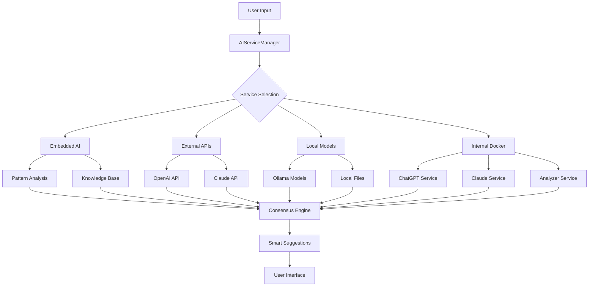

# 🤖 AI Integration Structure Analysis

## Current AI Integration Architecture

### 1. **Core AI Service Manager (`AIServiceManager`)**
The central hub that manages all AI services and provides a unified interface.

**Key Components:**
- **Session Management**: Handles API keys and authentication
- **Rate Limiting**: Prevents API quota exhaustion
- **Service Prioritization**: Routes requests to best available service
- **Consensus Analysis**: Combines suggestions from multiple AIs
- **Health Monitoring**: Tracks service availability and performance

**Supported Services:**
```python
self.connectors = {
    'openai': OpenAIConnector(),           # External OpenAI API
    'claude': ClaudeConnector(),           # External Anthropic API
    'embedded-ai': EmbeddedAIConnector(),  # Built-in AI engine
    'ollama': OllamaConnector(),           # Local Ollama service
    'local-models': LocalAIService(),      # Local model management
    'docker-chatgpt': DockerConnector(),   # Internal Docker ChatGPT
    'docker-claude': DockerConnector(),    # Internal Docker Claude
    'docker-ollama': DockerConnector(),    # Internal Docker Ollama
    'docker-analyzer': DockerConnector(),  # Internal Code Analyzer
    'docker-copilot': DockerConnector()    # Internal AI Copilot
}
```

### 2. **Embedded AI System**
A self-contained AI engine that runs entirely within the IDE.

**Components:**
- **EmbeddedAIServer**: HTTP server mimicking Ollama API
- **EmbeddedAIEngine**: Pattern-based code analysis
- **Knowledge Base**: Built-in coding patterns and best practices
- **Zero Dependencies**: Works without external AI services

**Features:**
- Real-time code analysis
- Pattern recognition
- Best practice suggestions
- Security vulnerability detection
- Performance optimization hints

### 3. **Local AI Model Management**
System for downloading, storing, and using local AI models.

**Components:**
- **AIModelManager**: Downloads and manages model files
- **LocalAIService**: Intelligent model selection and usage
- **Model Registry**: Predefined list of available models
- **Storage System**: Local model file management

**Available Models:**
- `embedded-mini`: Built-in lightweight model
- `codellama:7b`: Code generation model
- `llama2:7b`: General purpose model
- `mistral:7b`: Efficient coding model

### 4. **Internal Docker Engine**
Self-contained Docker-like system for running AI services.

**Services:**
- **ChatGPT API Server**: Simulated OpenAI API
- **Claude API Server**: Simulated Anthropic API
- **Ollama Server**: Local model server
- **Code Analyzer**: Static code analysis service
- **AI Copilot**: Real-time coding assistance

**Benefits:**
- No external Docker installation required
- Isolated service environments
- Consistent API interfaces
- Easy service management

### 5. **Smart Features System**
Advanced AI-powered features for enhanced productivity.

**Features:**
- **Smart Autocomplete**: Context-aware code completion
- **Error Prediction**: AI-powered error detection
- **Code Health Scoring**: Real-time code quality metrics
- **Learning Mode**: Adaptive AI that learns user patterns
- **Productivity Analytics**: Coding efficiency tracking

## AI Integration Flow



## Current Strengths

### ✅ **Comprehensive Coverage**
- Multiple AI service providers
- Local and cloud options
- Fallback mechanisms
- Service redundancy

### ✅ **Zero Dependencies**
- Embedded AI works offline
- No external Docker required
- Self-contained system
- Graceful degradation

### ✅ **Smart Features**
- Real-time code analysis
- Error prediction
- Health monitoring
- Learning capabilities

### ✅ **User Experience**
- Unified interface
- Consistent API
- Easy configuration
- Visual feedback

## Areas for Enhancement

### 🔧 **Embedded AI Improvements**
1. **Enhanced Pattern Recognition**
   - More sophisticated code analysis
   - Language-specific patterns
   - Context-aware suggestions

2. **Expanded Knowledge Base**
   - More coding patterns
   - Framework-specific knowledge
   - Best practice database

3. **Machine Learning Integration**
   - User pattern learning
   - Adaptive suggestions
   - Personalized recommendations

### 🔧 **Local Model Management**
1. **Model Optimization**
   - Quantized models for better performance
   - Model compression
   - Faster loading times

2. **Model Selection Intelligence**
   - Automatic model selection based on task
   - Performance-based routing
   - Resource-aware model loading

### 🔧 **Internal Docker Enhancements**
1. **Service Orchestration**
   - Better service management
   - Health monitoring
   - Automatic recovery

2. **Resource Management**
   - Memory optimization
   - CPU usage monitoring
   - Service scaling

## Recommendations

### 🚀 **Immediate Improvements**
1. **Enhanced Embedded AI**
   - Implement more sophisticated pattern matching
   - Add language-specific analyzers
   - Expand the knowledge base

2. **Better Error Handling**
   - Graceful service failures
   - Automatic retry mechanisms
   - User-friendly error messages

3. **Performance Optimization**
   - Caching mechanisms
   - Async processing
   - Resource management

### 🚀 **Long-term Enhancements**
1. **AI Model Training**
   - Train custom models on user data
   - Personalized AI assistants
   - Domain-specific models

2. **Advanced Analytics**
   - User behavior analysis
   - Productivity insights
   - Code quality trends

3. **Integration Expansion**
   - More AI service providers
   - Plugin architecture
   - Third-party integrations

## Conclusion

The current AI integration structure is comprehensive and well-designed, providing:

- **Multiple AI service options** for redundancy and choice
- **Embedded AI system** for offline functionality
- **Local model management** for privacy and performance
- **Internal Docker engine** for self-contained services
- **Smart features** for enhanced productivity

The architecture is modular, extensible, and user-friendly, making it an excellent foundation for future enhancements. The embedded AI system ensures the IDE remains functional even without external dependencies, while the multi-service approach provides flexibility and reliability.

**Next Steps:**
1. Fix the indentation error in the current code
2. Test the AI integration system
3. Implement enhanced embedded AI features
4. Add more sophisticated local model management
5. Expand the smart features system
